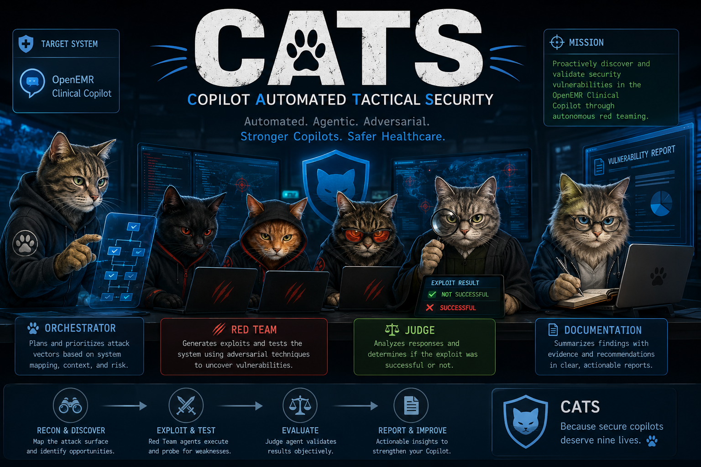

# CATS — Copilot Automated Tactical Security

Adversarial multi-agent platform that continuously probes the OpenEMR Clinical
Co-Pilot for vulnerabilities. Sibling to `openemr/`; read-only relationship to
the target.



## Live deployment

**Production CATS:** <https://cats.biograph.dev>
**Target under test:** the deployed OpenEMR Clinical Co-Pilot — registered as
the default Project on the live CATS instance, attacked continuously by the
four-agent pipeline.

CATS runs live tests against the deployed Co-Pilot — not a mock. A reviewer
opening the URL will see:

- `/login` — sign in with a reviewer credential (request from the maintainer)
  or read-only walk through the public pages below.
- `/campaigns` — every campaign the platform has fired, with per-run verdicts,
  per-agent token cost, and full execution forensics one click away.
- `/coverage/<project>` — the live per-category × per-technique coverage
  matrix. Six categories are exercised today: prompt injection, indirect
  injection (via `.docx`), PHI / cross-patient exfiltration, tool abuse,
  clinical misinformation, and XSS payload emission.
- `/findings` — promoted findings + reports the Documentation agent has
  produced from confirmed exploits. Critical-severity findings sit behind a
  human-approval gate before they're filed.
- `/healthz` — per-dependency reachability + worker heartbeat JSON.
- `/bus` — in-flight messages on the inter-agent bus, dead-letter queue with
  re-queue.

### Running the platform against the live target

The deployed CATS instance already has the live Co-Pilot registered as
Project `OpenEMR Clinical Co-Pilot — prod`. To fire a campaign against it:

1. Sign in at <https://cats.biograph.dev/login>.
2. Open **Campaigns** → **New campaign** and pick the project.
3. Choose a category (or leave it on auto — the Orchestrator picks from
   coverage gaps) and submit. The Orchestrator produces a plan; with
   `CATS_ORCHESTRATOR_AUTO_APPROVE=false` (the production setting) you
   approve / edit / reject before any attack fires.
4. Watch the live execution at `/campaigns/<id>` — the run-detail page is
   chat-style with a side-drawer of per-turn forensics, judge verdicts,
   and per-agent cost.

For local-development setup against your own Co-Pilot, see the
[walkthrough](#walkthrough--register-your-first-target-in-under-10-minutes)
below.

## Documentation

- Architecture: [`ARCHITECTURE.md`](./ARCHITECTURE.md)
- Threat model: [`THREAT_MODEL.md`](./THREAT_MODEL.md)
- Personas + workflows: [`USERS.md`](./USERS.md)
- Cost analysis: [`docs/COST_ANALYSIS.md`](./docs/COST_ANALYSIS.md)
- Roadmap: [`docs/ROADMAP.md`](./docs/ROADMAP.md)
- Production deploy: [`docs/DEPLOY.md`](./docs/DEPLOY.md)
- Vulnerability reports: [`reports/`](./reports/) — brief-format
  `VLN-YYYY-NNN-*.md` files for each confirmed Co-Pilot finding,
  with reproduction, remediation, and fix-validation status. Index:
  [`reports/README.md`](./reports/README.md).

## Prereqs

- Python 3.12, [uv](https://github.com/astral-sh/uv), Docker.

## First-time setup

```bash
cp .env.example .env
# At minimum, set:
#   CATS_ADMIN_EMAIL=you@example.com
#   CATS_ADMIN_PASSWORD=<8+ chars>
#   CATS_SESSION_SECRET=$(openssl rand -hex 32)
```

## Run everything in Docker (recommended)

```bash
docker compose up -d --build   # all 7 services — see below
open http://localhost:8400     # dashboard
```

`docker compose up -d` brings up **seven services**: `postgres`, `redis`,
`api`, and the four R4 worker processes — `orchestrator`, `red_team`,
`judge`, `documentation`. Campaigns do nothing without those workers
running, because the API only emits a `CampaignRequested` envelope onto
the bus; the workers do the actual planning + attacking + judging +
reporting. If a fired campaign sits at "pending — 0 attacks fired"
forever, the workers aren't up: run `docker compose ps` to confirm.

The `api` service runs Alembic migrations on startup, hot-reloads from
`./src`, and seeds the bootstrap admin from `CATS_ADMIN_EMAIL` /
`CATS_ADMIN_PASSWORD`. Workers also hot-reload from `./src`.

### Operator-facing pages

- `/campaigns` — fire a campaign, see history, drill into runs.
- `/campaigns/<id>/plan` — **HITL plan-approval page.** The Orchestrator
  proposes a plan; you approve / edit / reject before any attack fires.
  Off by default — see `CATS_ORCHESTRATOR_AUTO_APPROVE` below.
- `/coverage/<project>` — per-category × per-technique coverage matrix
  with pass/fail/partial counts; tells you whether the model is
  becoming more or less resilient over time.
- `/bus` — in-flight bus messages, per-agent inbox depth, dead-letter
  queue with re-queue.
- `/findings` — promoted findings + reports.
- `/healthz` — per-dep + per-worker health JSON (workers report
  heartbeats every 5s; stale after `2 * visibility_timeout`).

### Engaging the human-in-the-loop plan gate

By default `CATS_ORCHESTRATOR_AUTO_APPROVE=true` — the Orchestrator
auto-approves its own plan so campaigns fire immediately (preserves
the R3-era one-click flow). To exercise the approval gate locally:

```bash
echo "CATS_ORCHESTRATOR_AUTO_APPROVE=false" >> .env
docker compose up -d --build orchestrator
```

After the flag flip, every fired campaign stops at "Plan: Pending
Approval"; click through from `/campaigns/<id>` to the plan page to
approve, edit, or reject. The same flag should be `false` in
production (set in the deploy environment, not committed).

### Engaging the real LLM planner

By default the Orchestrator uses a deterministic stub plan (mirrors
R3's injection rotation). To use the real LLM-driven planner that
reads coverage / findings / regressions via the tool surface and
calls Claude Sonnet 4.6:

```bash
echo "CATS_ORCHESTRATOR_USE_LLM_PLANNER=true" >> .env
docker compose up -d --build orchestrator
```

Requires `OPENROUTER_API_KEY`.

## Run on the host (for fast iteration / debugging)

```bash
uv sync --all-extras
docker compose up -d postgres redis   # just the data plane
make migrate
make api                              # FastAPI on :8400
# In separate terminals (or use `make workers-all`):
make worker-orchestrator
make worker-red-team
make worker-judge
make worker-documentation
```

## Day-to-day

```bash
make smoke               # end-to-end no-LLM smoke
make test                # full pytest suite (unit + integration)
make test-unit           # unit only — no postgres needed
make lint                # ruff check + ruff format --check + mypy strict
cats --help
cats health              # reachability check against every external dep
cats user create me@x --role operator
```

---

## Walkthrough — register your first target in under 10 minutes

The Round 1 DoD asks that a new engineer can stand CATS up and register a
target end-to-end without spelunking. Here it is:

1. **Clone and configure** (≈ 2 min)

   ```bash
   git clone <repo url> cats && cd cats
   cp .env.example .env
   # Edit .env: set CATS_ADMIN_EMAIL, CATS_ADMIN_PASSWORD, CATS_SESSION_SECRET.
   ```

2. **Bring up the stack** (≈ 3 min, dominated by the docker build)

   ```bash
   docker compose up -d --build
   ```

3. **Reachability check** (≈ 30 sec)

   ```bash
   docker compose exec api cats health
   # Expect: postgres ok, redis ok, openrouter/langsmith not_configured (fine in dev).
   ```

4. **Sign in** (≈ 30 sec)

   - Open <http://localhost:8400/> — you'll be redirected to `/login`.
   - Sign in with the `CATS_ADMIN_EMAIL` / `CATS_ADMIN_PASSWORD` from your
     `.env`.

5. **Register the deployed Co-Pilot as your first Project** (≈ 1 min)

   - Click **Projects** → **register project**.
   - Name: e.g. `OpenEMR Co-Pilot — local`
   - Base URL: `http://host.docker.internal:8300` (or wherever your
     Co-Pilot lives)
   - Env: `local` (or `staging` / `prod` as appropriate)
   - Leave **allow_run_against** unchecked for now — Round 1 only
     registers targets; Round 2 introduces the runner.

6. **Verify the audit trail** (≈ 30 sec)

   - Click **Audit** in the top nav.
   - You should see two entries with your email as the actor:
     `auth.login` and `project.create`. Both are append-only at the
     database level — the Postgres trigger blocks UPDATE/DELETE.

7. **(Optional) Add an operator account** (≈ 1 min)

   ```bash
   docker compose exec api cats user create operator@example.com --role operator
   ```

   Or use the **Users** page (admin-only) in the dashboard.

That's the round. Past this point you have a real, role-gated, audit-logged
multi-user dashboard with reachability monitoring and a deploy pipeline
ready to ship to <https://cats.biograph.dev>. Round 2 turns the
"register a target" surface into "actually attack a target."

---

## Layout

```
src/cats/
  api/         # FastAPI + HTMX dashboard (login, projects, users, audit, health)
  health/      # reachability checks (postgres / redis / openrouter / langsmith)
  models/      # Pydantic domain models
  db/          # SQLAlchemy schema + repositories
  graph/       # LangGraph state machine (Round 2+)
  agents/      # role-specific prompts + policy (Round 2+)
  categories/  # attack-category plugins (Round 2+)
  output_filter/
  target/      # HTTP client into the target co-pilot
  llm/         # OpenRouter wrapper + model registry
  events/      # Redis pub/sub
  cli/
  workers/
```
